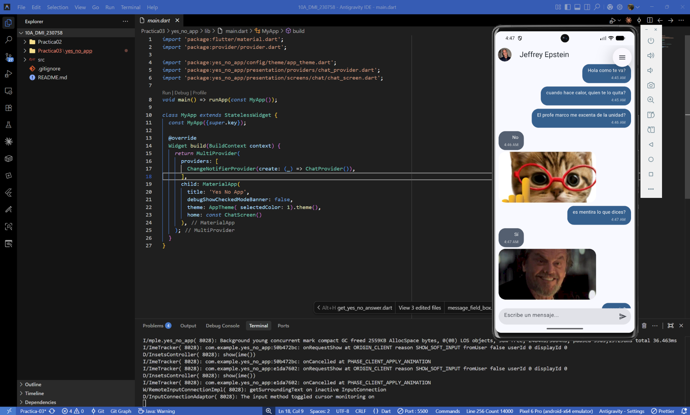
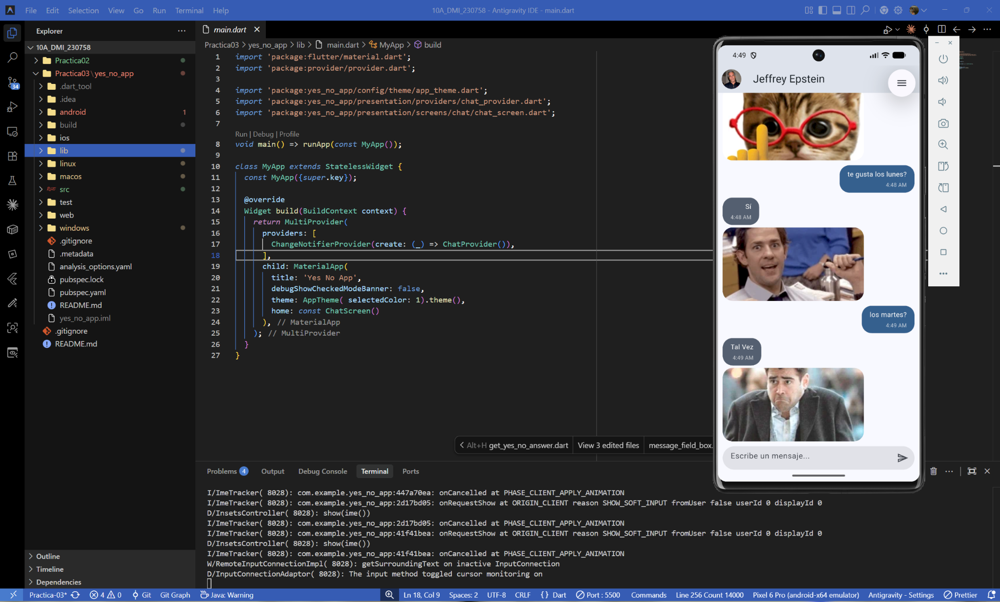
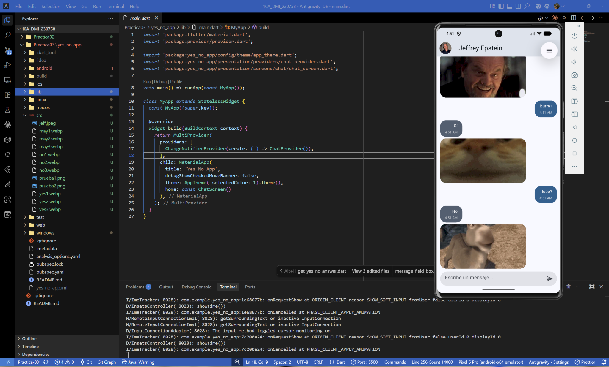
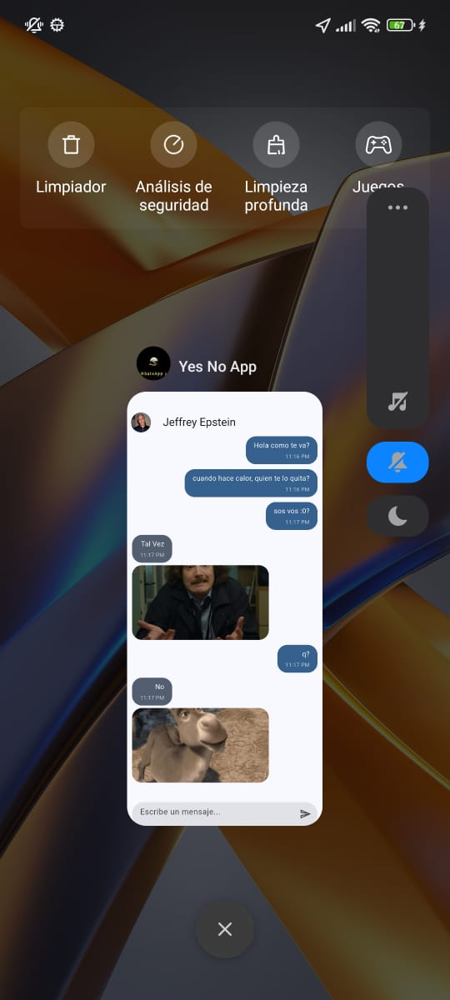
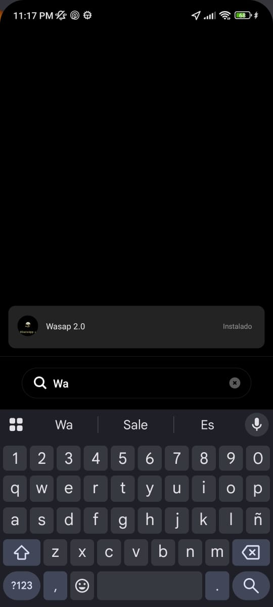

# Práctica 03: Yes No App - Chat Interactivo

- **Asignatura:** Desarrollo Móvil Integral (10° Cuatrimestre)
- **Carrera:** Ingeniería en Desarrollo y Gestión de Software
- **Docente:** M.T.I. Marco A. Ramírez Hernández
- **Alumno:** Francisco García García
- **Matrícula:** 230758
- **Periodo:** Septiembre - Diciembre 2026

---

## Objetivo de la Práctica

El objetivo de esta práctica es desarrollar una aplicación de chat interactiva en Flutter implementando una arquitectura limpia y manejo de estados global. Durante la práctica se emplean conceptos clave de inyección de dependencias, peticiones HTTP a APIs externas (`yesno.wtf`), y actualización de interfaz en tiempo real. 

Se pone énfasis en el uso del paquete `Provider` para la gestión del estado de los mensajes, el uso de `Dio` para las peticiones de red, y la separación de capas (Domain, Infrastructure, Presentation, Config) para asegurar un código escalable y mantenible.

---

## Tecnologías Utilizadas

| Tecnología                         | Versión / Especificación | Propósito en el Proyecto                                                                                               |
| :---------------------------------- | :------------------------: | :---------------------------------------------------------------------------------------------------------------------- |
| **Flutter SDK**               | `^3.13.3` | Framework principal de desarrollo de interfaces.                                                           |
| **Dart SDK**                  | `^3.13.3` | Lenguaje de programación.                                                                              |
| **Provider**                  | `^6.1.5+1`| Gestor de estado global para notificar cambios en la lista de mensajes y redibujar la UI.             |
| **Dio**                       | `^5.11.1` | Cliente HTTP avanzado para realizar peticiones REST a la API de respuestas aleatorias.                 |
| **Material Design 3**         | Nativo    | Uso de `ThemeData(useMaterial3: true)`, colores generados por semilla y componentes modernos.          |

---

## Cómo Abrir y Ejecutar el Proyecto

1. **Clonar el repositorio:**
   ```bash
   git clone https://github.com/F-Anks/10A_DMI_230758.git
   ```
2. **Cambiar a la rama de la práctica (opcional si ya estás en main):**
   ```bash
   git checkout Practica-03
   ```
3. **Entrar a la carpeta del proyecto:**
   ```bash
   cd Practica03/yes_no_app
   ```
4. **Instalar dependencias (Provider, Dio, etc.):**
   ```bash
   flutter pub get
   ```
5. **Lanzar la aplicación:**
   ```bash
   flutter run
   ```

---

## 🏗️ Estructura y Arquitectura del Proyecto

El proyecto está diseñado bajo un enfoque de **Clean Architecture** estructurando las carpetas en capas lógicas:

> 🗺️ **Diagrama Interactivo:** Puedes explorar el flujo y la arquitectura detallada abriendo el archivo [architecture.html](./architecture.html) en tu navegador.

```
📦 yes_no_app/
│
├── 📂 lib/
│   │
│   ├── 📄 main.dart                           ← Configuración de MultiProvider y Tema global
│   │
│   ├── 📂 config/
│   │   ├── 📂 helpers/
│   │   │   └── 📄 get_yes_no_answer.dart      ← Petición HTTP a la API y selección de GIFs
│   │   └── 📂 theme/
│   │       └── 📄 app_theme.dart              ← Tema global de Material 3 con paleta personalizada
│   │
│   ├── 📂 domain/
│   │   └── 📂 entities/
│   │       └── 📄 message.dart                ← Entidad de negocio principal (Texto, GIF, Remitente)
│   │
│   ├── 📂 infrastructure/
│   │   └── 📂 models/
│   │       └── 📄 yes_no_model.dart           ← Modelo Mapeador de la respuesta JSON de la API
│   │
│   └── 📂 presentation/
│       ├── 📂 providers/
│       │   └── 📄 chat_provider.dart          ← Gestor de estado para la lista de mensajes y el scroll
│       ├── 📂 screens/
│       │   └── 📂 chat/
│       │       └── 📄 chat_screen.dart        ← Interfaz principal del chat
│       └── 📂 widgets/
│           ├── 📂 chat/
│           │   ├── 📄 her_message_bubble.dart ← Burbuja de chat de "la otra persona" (soporte a GIFs locales/red)
│           │   └── 📄 my_message_bubble.dart  ← Burbuja de chat del usuario actual
│           └── 📂 shared/
│               └── 📄 message_field_box.dart  ← Input de texto con botón de envío
```

---

## 📸 Resultados y Evidencias Visuales

A continuación se muestran capturas del funcionamiento de la aplicación, donde se observan burbujas de texto diferenciadas y la inserción de imágenes animadas (GIFs) en las respuestas.

### 1. Interfaz Principal y Mensajes
El usuario envía mensajes que se colocan a la derecha. Si el mensaje termina con un signo de interrogación (`?`), se gatilla una respuesta automática en la izquierda.

<div align="center">
  
</div>

### 2. Respuestas Automáticas con GIFs (Sí / No)
La app responde a las preguntas con texto y un GIF ilustrativo acorde a la respuesta.

<div align="center">
  
</div>

### 3. Respuestas Aleatorias (Tal Vez)
Además del Sí y No, el sistema puede devolver respuestas variadas con GIFs personalizados utilizando lógica condicional en la capa de helpers.

<div align="center">
  
</div>

### 4. Instalación Nativa (Icono y Nombre Personalizado)
La aplicación fue configurada exitosamente para ejecutarse en dispositivos físicos con un nombre comercial ("Wasap 2.0") y un ícono personalizado generado a través de `flutter_launcher_icons`, demostrando el proceso de despliegue real en Android.

<div align="center">
  
  
</div>

---

## Conclusiones

1. **Gestión de Estado Robusta:** Se comprendió la necesidad y eficacia de separar el estado de la UI utilizando el patrón Provider (`ChangeNotifier`), permitiendo que el árbol de widgets se actualice solo cuando es necesario (`notifyListeners()`).
2. **Peticiones HTTP y JSON:** La implementación de la librería `Dio` y el mapeo de JSON estructurado mediante modelos de infraestructura garantizan que la capa de presentación consuma entidades puras sin depender de formatos externos.
3. **Control de Scroll:** Se implementó lógica para que el controlador de lista se mueva de manera animada hacia el último mensaje enviado automáticamente.
4. **Diseño Modular:** La separación de componentes (`MyMessageBubble`, `HerMessageBubble`, `MessageFieldBox`) resultó en archivos limpios, reutilizables y con una única responsabilidad.
