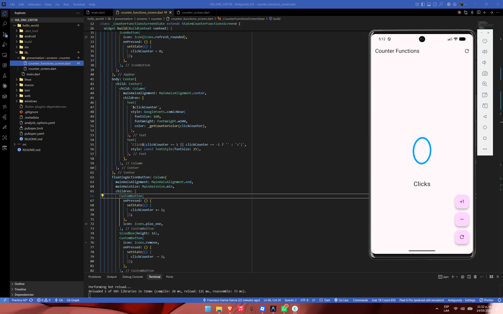
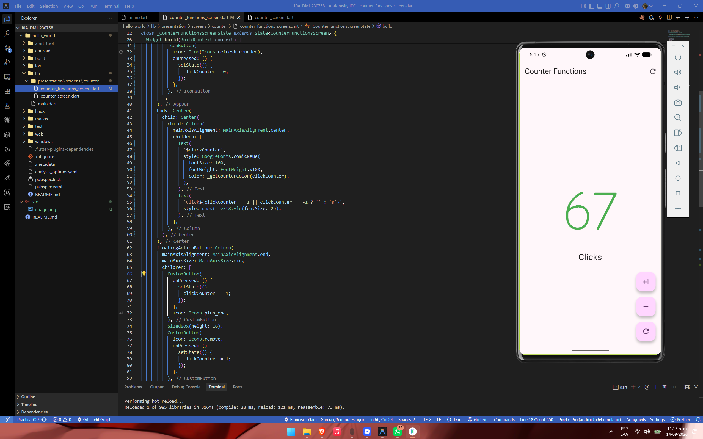
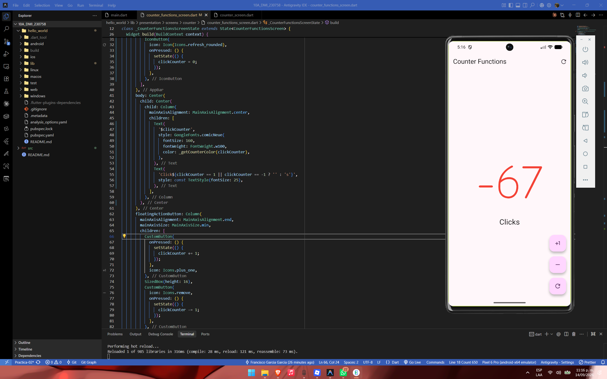

# Práctica 02: Mi Primera Aplicación Móvil con Flutter - Contador

- **Asignatura:** Desarrollo Móvil Integral (10° Cuatrimestre)
- **Carrera:** Ingeniería en Desarrollo y Gestión de Software
- **Docente:** M.T.I. Marco Antonio Ramírez Hernández
- **Alumno:** Francisco García García
- **Matrícula:** 230758
- **Periodo:** Septiembre - Diciembre 2026

---

## Objetivo de la Práctica

Diseñar, estructurar y desarrollar una aplicación móvil interactiva utilizando el framework **Flutter** y el lenguaje de programación **Dart**, comprendiendo la arquitectura basada en árboles de widgets, la diferencia y aplicación práctica de widgets sin estado (`StatelessWidget`) y con estado (`StatefulWidget`), y la manipulación reactiva de la interfaz mediante `setState()`.

La aplicación implementa un contador funcional avanzado que permite sumar, restar y reiniciar el valor, incorporando lógica de negocio visual con cambio dinámico de colores según el signo numérico, pluralización gramatical inteligente (`Click` vs. `Clicks`) y personalización estética global a través de `ThemeData` y tipografías externas mediante `google_fonts`.

---

## Tecnologías Utilizadas

| Tecnología                         | Versión / Especificación | Propósito en el Proyecto                                                                                               |
| :---------------------------------- | :------------------------: | :---------------------------------------------------------------------------------------------------------------------- |
| **Flutter SDK**               | `3.47.4` (Canal stable) | Framework principal de desarrollo de interfaces multiplataforma compiladas de forma nativa.                             |
| **Dart SDK**                  |         `3.13.3`         | Lenguaje de programación fuertemente tipado y orientado a objetos base de Flutter.                                     |
| **Material Design 3**         |    Incluido en Flutter    | Sistema de diseño de UI para componentes interactivos (AppBar, FloatingActionButton, Scaffold).                        |
| **google_fonts**              |         `^6.2.1`         | Paquete oficial para cargar y renderizar fuentes tipográficas dinámicas (`Comic Neue`).                             |
| **cupertino_icons**           |         `^1.0.8`         | Biblioteca de glifos e iconos estilo iOS integrados.                                                                    |
| **Material Icons**            |     Nativo de Flutter     | Iconografía vectorizada (`Icons.plus_one`, `Icons.remove`, `Icons.refresh_outlined`, `Icons.refresh_rounded`). |
| **Antigravity IDE / VS Code** |      Última versión      | Entorno de desarrollo integrado con herramientas de análisis estático y depuración.                                  |
| **Android Emulator**          |   Pixel 6 Pro (API x64)   | Dispositivo virtual para emulación y pruebas en tiempo real.                                                           |
| **Git & GitHub**              |    Control de versiones    | Flujo de trabajo con control de versiones distribuido bajo la rama`Practica-02`.                                      |

---

## Cómo Abrir y Ejecutar el Proyecto

### Requisitos Previos

Antes de ejecutar la aplicación, asegúrate de tener instalado en tu sistema:

1. **Flutter SDK** (versión 3.10 o superior) configurado en las variables de entorno (`PATH`).
2. **Android Studio** o **VS Code** con las extensiones oficiales de **Flutter** y **Dart**.
3. Un emulador Android configurado o un dispositivo físico conectado con depuración USB habilitada.
4. Para validar la instalación general de herramientas, ejecuta en tu terminal:
   ```bash
   flutter doctor
   ```

### Pasos de Instalación y Ejecución

1. **Clonar el repositorio:**

   ```bash
   git clone https://github.com/F-Anks/10A_DMI_230758.git
   ```
2. **Acceder al directorio del repositorio y cambiar a la rama de la práctica:**

   ```bash
   cd 10A_DMI_230758
   git checkout Practica-02
   ```
3. **Entrar a la carpeta del proyecto Flutter:**

   ```bash
   cd hello_world
   ```
4. **Descargar e instalar las dependencias declaradas en `pubspec.yaml`:**

   ```bash
   flutter pub get
   ```
5. **Verificar los dispositivos disponibles:**

   ```bash
   flutter devices
   ```
6. **Lanzar la aplicación en modo desarrollo (Debug):**

   ```bash
   flutter run
   ```

> [!TIP]
> Durante la ejecución puedes presionar `r` en la consola para realizar un **Hot Reload** y aplicar cambios instantáneamente, o `R` para un **Hot Restart**.

---

## 🏗️ Arquitectura del Proyecto

### Árbol de Directorios Completo

```
📦 hello_world/
│
├── 📂 lib/
│   │
│   ├── 📄 main.dart                           ← Punto de entrada de la aplicación
│   │       • main()
│   │       • MyApp [StatelessWidget]
│   │       • counterZeroColor [const]
│   │       • counterPositiveColor [const]
│   │       • counterNegativeColor [const]
│   │
│   └── 📂 presentation/
│       │
│       └── 📂 screens/
│           │
│           └── 📂 counter/
│               │
│               ├── 📄 counter_screen.dart      ← Pantalla básica del contador (versión inicial)
│               │       • CounterScreen [StatefulWidget]
│               │       • _CounterScreenState [State]
│               │       • CustomButton [StatelessWidget]
│               │
│               └── 📄 counter_functions_screen.dart   ← Pantalla principal con funciones avanzadas
│                       • CounterFunctionsScreen [StatefulWidget]
│                       • _CounterFunctionsScreenState [State]
│                       • _getCounterColor() [método privado]
│                       • CustomButton [StatelessWidget]
│
├── 📂 test/
│   └── 📄 widget_test.dart                     ← Pruebas unitarias de widgets
│
├── 📂 android/                                 ← Configuración nativa Android
├── 📂 ios/                                     ← Configuración nativa iOS
├── 📂 web/                                     ← Configuración para plataforma web
├── 📂 linux/                                   ← Configuración nativa Linux
├── 📂 macos/                                   ← Configuración nativa macOS
├── 📂 windows/                                 ← Configuración nativa Windows
│
├── 📄 pubspec.yaml                             ← Dependencias y metadatos del proyecto
├── 📄 pubspec.lock                             ← Versiones exactas de dependencias instaladas
├── 📄 analysis_options.yaml                    ← Reglas de análisis estático de Dart
├── 📄 .gitignore                               ← Archivos excluidos del control de versiones
├── 📄 .metadata                                ← Metadatos internos de Flutter
└── 📄 README.md                                ← Documentación del proyecto (este archivo)
```

### Diagrama Interactivo de Arquitectura (Archify)

El diagrama completo de la arquitectura del proyecto fue generado con **Archify** y se encuentra disponible como un archivo HTML interactivo auto-contenido con soporte para tema claro/oscuro, zoom, y navegación por componentes:

📎 **[Ver diagrama de arquitectura interactivo → `hello_world-architecture.html`](./architecture/hello_world-architecture.html)**

> [!TIP]
> El diagrama permite alternar entre tema oscuro y claro con la tecla `T`, hacer zoom con `+`/`-`, y navegar entre las vistas predefinidas ("Ciclo de vida completo" y "Gestión del estado") desde el menú lateral.

---


## Descripción Detallada de los Componentes

### 1. `main.dart` (Configuración Global y Punto de Entrada)

- **Función `main()`:** Inicializa la ejecución del árbol de widgets invocando `runApp(const MyApp())`.
- **Paleta de Colores Constante:** Se definen de manera centralizada las constantes de color utilizadas por el contador:
  - `counterZeroColor`: Color azul (`Color.fromARGB(255, 7, 164, 255)`).
  - `counterPositiveColor`: Color verde (`Colors.green`).
  - `counterNegativeColor`: Color rojo (`Colors.red`).
- **Configuración de Tema (`ThemeData`):** Se establece la semilla de color principal (`colorSchemeSeed`) con tono magenta/violeta y se asigna globalmente la tipografía `Comic Neue` a través de `GoogleFonts.comicNeue()`.
- **Pantalla Inicial:** Define a `CounterFunctionsScreen` como la vista principal (`home`).

### 2. `counter_functions_screen.dart` (Pantalla Principal de Funciones)

Esta pantalla es el núcleo interactivo de la práctica y contiene las siguientes características técnicas:

- **Manejo del Estado (`_CounterFunctionsScreenState`):** Administra la variable de instancia `int clickCounter = 0` que almacena el valor numérico en memoria.
- **Función de Color Dinámico (`_getCounterColor`):**
  ```dart
  Color _getCounterColor(int value) {
    if (value == 0) {
      return counterZeroColor;
    } else if (value > 0) {
      return counterPositiveColor;
    } else {
      return counterNegativeColor;
    }
  }
  ```

  Permite que el texto numérico gigante cambie su color de forma inmediata dependiendo de si el valor es neutro, positivo o negativo.
- **Lógica de Pluralización Inteligente:**
  ```dart
  'Click${clickCounter == 1 || clickCounter == -1 ? '' : 's'}'
  ```

  Garantiza coherencia gramatical estricta:- Muestra **"Click"** (singular) cuando el valor es exactamente `1` o `-1`.
  - Muestra **"Clicks"** (plural) cuando el valor es `0`, mayor a 1 (`2, 3...`) o menor a -1 (`-2, -3, -67...`).
- **Botón de Reinicio en AppBar:** Acción rápida en la cabecera con el icono `Icons.refresh_rounded` que restablece el contador a cero.
- **Columna de Botones Flotantes (`FloatingActionButton`):**
  - Botón de incremento (+1) con icono `Icons.plus_one`.
  - Botón de decremento (-1) con icono `Icons.remove`.
  - Botón de reinicio con icono `Icons.refresh_outlined`.
- **Componente Reutilizable `CustomButton`:** Widget desacoplado que encapsula el comportamiento del botón de acción flotante, recibiendo el icono (`IconData`) y el evento (`VoidCallback onPressed`) para cumplir con el principio de responsabilidad única.

### 3. `counter_screen.dart` (Versión Base del Contador)

Pantalla inicial desarrollada como primera iteración del contador. Contiene la estructura básica con `StatefulWidget` y un `CustomButton` local sin la lógica avanzada de colores dinámicos ni el botón de reinicio en el AppBar.

---

## 📸 Resultados y Evidencias Visuales

A continuación se presentan las capturas de pantalla tomadas durante las pruebas de ejecución en el emulador **Pixel 6 Pro**:

### 1. Estado Inicial (Valor Cero)

El contador inicia en `0`. Se observa el color azul correspondiente a `counterZeroColor`, la leyenda en plural `"Clicks"` y la disponibilidad de los tres botones flotantes.

<div align="center">
  
</div>

---

### 2. Estado Positivo (Incremento)

Al presionar el botón `+1` de manera consecutiva, el contador toma valores positivos (en este caso `67`). El texto adopta automáticamente el color verde (`counterPositiveColor`) y mantiene la leyenda `"Clicks"`.

<div align="center">
  
</div>

---

### 3. Estado Negativo (Decremento)

Al presionar el botón de resta `-`, el contador disminuye hacia valores negativos (en este caso `-67`). El texto adopta dinámicamente el color rojo (`counterNegativeColor`) y refleja la pluralización correspondiente `"Clicks"`.

<div align="center">
  
</div>

---

### Tabla Comparativa de Comportamiento Evaluado

|     Estado del Contador     | Valor de Ejemplo |      Color Visualizado      | Texto Generado | Botón Accionado        |
| :-------------------------: | :--------------: | :-------------------------: | :------------: | :---------------------- |
| **Neutro / Inicial** |      `0`      |    🔵 Azul (`#07A4FF`)    |   `Clicks`   | Inicio o botón Refresh |
| **Singular Positivo** |      `1`      | 🟢 Verde (`Colors.green`) |   `Click`   | Botón`+1`            |
|  **Plural Positivo**  |      `67`      | 🟢 Verde (`Colors.green`) |   `Clicks`   | Botón`+1`            |
| **Singular Negativo** |      `-1`      |  🔴 Rojo (`Colors.red`)  |   `Click`   | Botón`-`             |
|  **Plural Negativo**  |     `-67`     |  🔴 Rojo (`Colors.red`)  |   `Clicks`   | Botón`-`             |

---

## Conclusiones

1. **Comprensión del Ciclo de Vida y Reactividad:** El uso de `StatefulWidget` en conjunto con el método `setState()` demostró ser el pilar fundamental para desencadenar el redibujado selectivo de los widgets en pantalla cada vez que muta el estado interno del contador.
2. **Modularización y Componentes Limpios:** La extracción de widgets repetitivos en componentes especializados como `CustomButton` fomenta el desacoplamiento, reduce la duplicación de código y simplifica el mantenimiento a largo plazo.
3. **Control Dinámico de la Experiencia de Usuario:** La incorporación de reglas de negocio en la UI —como la alteración dinámica de colores en tiempo real y el tratamiento gramatical de cadenas de texto— mejora sustancialmente la interacción visual y la calidad percibida del producto software.
4. **Integración Eficiente de Paquetes Externos:** La utilización de `google_fonts` facilitó la incorporación de fuentes tipográficas (`Comic Neue`) sin necesidad de gestionar manualmente fuentes estáticas en la carpeta de activos, optimizando el flujo de desarrollo.
5. **Buenas Prácticas en el Control de Versiones:** La división del trabajo mediante ramas temáticas (`Practica-02`) y el uso de documentación exhaustiva garantizan la trazabilidad, orden y profesionalismo exigidos en proyectos académicos y de ingeniería de software.
